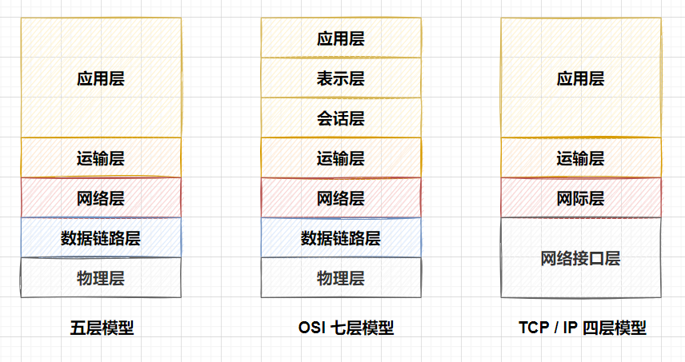
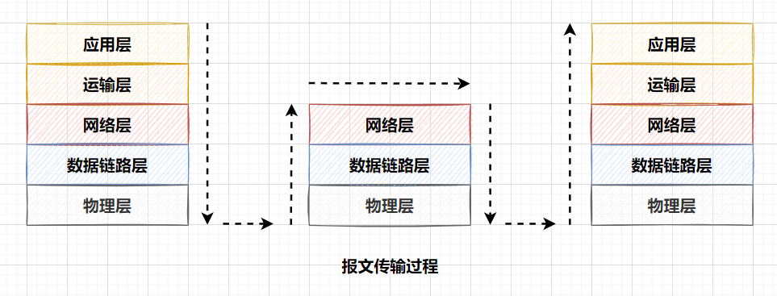

## 网络模型

> OSI 七层、TCP / IP 四层、五层协议

#### 一. 各种网络模型

##### 为什么要有网络模型

网络设备是多种多样的，我们需要一套标准的网络模型来兼容不同的设备或者平台以保证网络通信的正常运行。

##### 为什么会有几种网络模型 

OSI 是理论上的实现，但是在实际实现种我们不需要进行这么详细的分层。 实际种我们多为 TCP / IP 四层模型的实现。

##### 分层的作用是什么

协议分层有 **概念化** 和 **结构化** 的特点，将计算机网络拆成多层结构，在我们进行更新或修补的时候更加容易。但分层结构也可能出现一些冗余的结构，比如每一层都实现了需要基于时间戳进行校验的功能。

#### 二. 网络模型分层简介

> 此处展开列举各层简介

##### 应用层

应用层是网络应用程序及他们的应用层协议存留的地方，相关的协议有 **HTTP、DNS** 等。

##### 运输层

运输层在应用程序端点之间传送应用层报文，相关协议有 **TCP / UDP** 等。

##### 网络层

网络层负责将称为 **数据报** 的 **网络层分组** 从一台主机移动到另一台主机。常见协议有 **IP** 等。

##### 链路层

为了将分组从一个节点移动到路径上的下一个节点，网络层必须依靠该链路层的服务。

##### 物理层

链路层的任务是将整个帧从一个网络元素移动到临近的网络元素，而物理层的任务是将该帧种的一个个比特从一个节点移动到下一个节点。

#### 三. 传输过程

